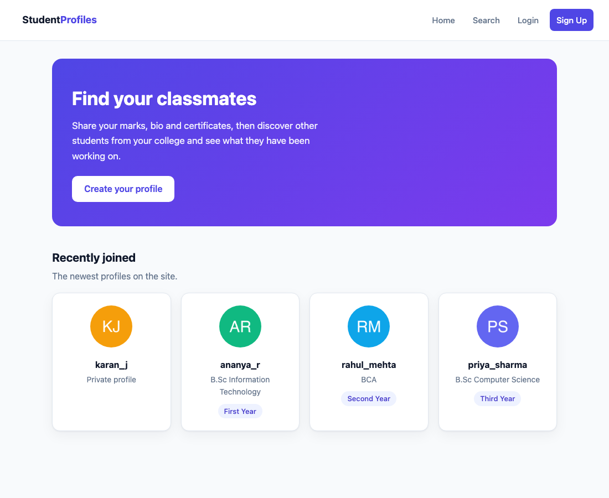
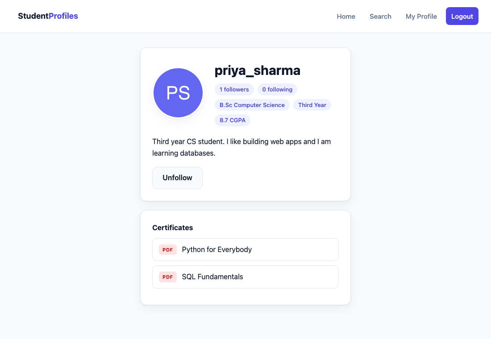
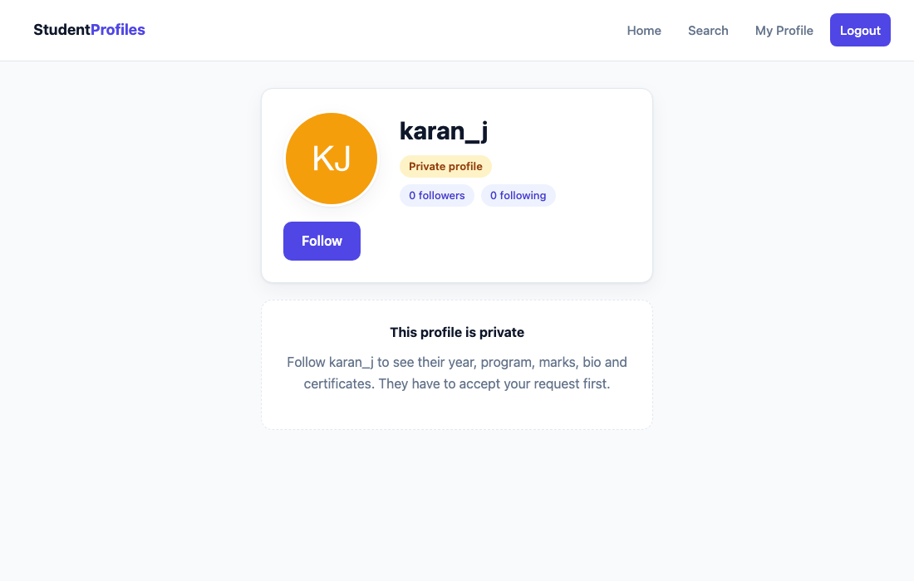
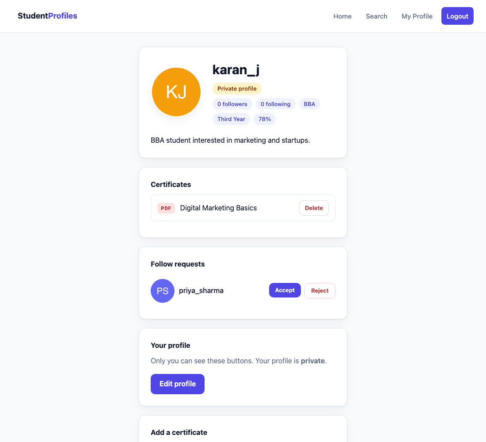

# Student Profiles

A college project. Students create a profile with a picture, bio, marks,
documents and posts. Everyone can browse the home page, search for students and
open their profiles. A profile can be made private, and then only accepted
followers can see the details. Students can also send each other direct
messages.

Written in C++ with the Crow web library and SQLite.

## Screenshots

**Home page.** New profiles are listed as cards. `karan_j` has a private
profile, so his card shows only a picture and a name.



**A profile.** Year, program, marks, bio and the certificate PDFs, plus a
button to follow or unfollow.



**A private profile seen by somebody else.** The details are replaced by a
message and a Follow button.



**Your own profile.** Follow requests waiting to be accepted, and the buttons
only you can see.



*(The students in these pictures are made up for the screenshots.)*

## What it uses

- C++ with the Crow library for the web server
- SQLite for the database (five tables: `students`, `documents`, `posts`,
  `messages`, `follows`)
- Plain HTML forms and one CSS file (the only JavaScript is the one-line
  "are you sure?" box on the delete button)

## Build

Needs [vcpkg](https://vcpkg.io) with `crow` and `sqlite3` installed.

```
cmake -B build -DCMAKE_TOOLCHAIN_FILE=<your vcpkg folder>/scripts/buildsystems/vcpkg.cmake
cmake --build build
```

## Run

Run it from the project folder, because it reads `templates/`, `static/` and
`database/schema.sql` using relative paths.

```
./build/student_profiles
```

Then open http://localhost:8090

## Pages

| Address | What it does |
| --- | --- |
| `/` | Home page: recommended students and the newest profiles |
| `/signup` | Form to create a profile (picture, marks, optional certificate) |
| `/login` | Login form |
| `/logout` | Logs out |
| `/profile` | Your own profile, with the edit and upload buttons |
| `/edit` | Form to change your picture, bio, year, program and marks |
| `/document` `/document/delete` | Add or remove one of your own documents |
| `/follow` `/unfollow` | Send, cancel or undo a follow |
| `/follow/accept` `/follow/reject` | Answer a request on your own profile |
| `/post` `/post/delete` | Write or remove one of your posts |
| `/messages` | Your conversations |
| `/messages/<id>` | The chat with one student |
| `/messages/send` | Sends a message |
| `/search` | Search students by username or program |
| `/student/<id>` | Another student's profile |

## The five tables

`students` holds one row per person.

`documents` holds one row per uploaded file, and its `student_id` column says
which student it belongs to. That is a one-to-many relationship: one student can
have many documents. A document can be a PDF or a picture, because a marksheet
is often just a photo, and the title is free text so it can be a marksheet, a
certificate, a transcript or anything else.

`posts` holds the short updates a student writes, with an optional file. It is
also one-to-many.

`messages` holds one row per direct message with a `sender_id` and a
`receiver_id`.

`follows` holds one row per follow, with `follower_id` (who asked),
`following_id` (who they want to follow) and `status`. That is a many-to-many
relationship: a student can follow many students and be followed by many. The
`UNIQUE (follower_id, following_id)` rule stops the same request being stored
twice.

## Posts

A post is a line or two of text with an optional PDF or picture. Posts show on
the profile, and follow the same visibility rule as everything else: on a
private profile only accepted followers see them. The home page also shows a
feed of the newest posts from the people you follow.

## Direct messages

Every student has a `dm_open` column. When it is on, any signed in student can
start a chat. When it is off, only the people whose follow requests you have
accepted can write to you.

`can_message` is the one function that decides this, and it is checked twice:
once when drawing the page, so the typing box is hidden, and again in
`/messages/send` before anything is saved. Hiding a form is not security on its
own, because anybody can send the request by hand.

A conversation query only ever selects rows where you are the sender or the
receiver, so there is no address you can visit to read somebody else's chat.

## Private profiles

Each student has an `is_private` column. When it is on, anybody who is not an
accepted follower sees only the picture and the username.

`status` is `pending` while a request is waiting and `accepted` once the owner
says yes. Following a public profile skips straight to `accepted`; following a
private one starts as `pending`.

One function, `can_see_details`, decides everything. A visitor sees the full
profile only if the profile is public, or they are the owner, or their follow
is accepted. The same rule is applied to the cards on the home and search
pages, so a private student shows up there as a picture and a name only.

Two smaller rules back this up, because a search box can leak things a profile
page does not:

- Searching by program only matches public profiles, otherwise typing a program
  name would tell you who studies it.
- The "same program" suggestions on the home page skip private profiles for the
  same reason.

## How it works

1. The signup form is sent as `multipart/form-data` because it has file inputs.
   The server reads each field with `get_part_by_name`.
2. Uploads are saved into `static/uploads/`, so the browser can open them like
   any other file. Both pictures and certificates include the time they were
   uploaded in the name, like `<username>_1789619099.jpg` and
   `<username>_cert1789619409.pdf`. This does two jobs: a new picture gets a new
   address so the browser does not show the old copy it had saved, and a new
   certificate can never overwrite one that is already there.
3. Only `.jpg`, `.jpeg` and `.png` are accepted for pictures, and only `.pdf`
   for certificates.
4. Login checks the username and password in the database and stores the
   student id in a cookie called `user_id`.
5. Pages are HTML files in `templates/` with placeholders like `{{USERNAME}}`.
   The server reads the file and swaps the placeholders for real values.
6. The home page recommends students on the same program as you. It reads your
   program from the database, then selects other students with that same
   program. If you are not logged in it only shows the newest profiles.
7. The edit and upload buttons only appear on your own profile, because
   `profile.html` is also used for other people's profiles and the server only
   fills in `{{OWNER_SECTION}}` when the profile id matches your cookie.
8. On the edit page the picture box is optional. If you leave it empty the
   server keeps your old picture; if you choose a new one it saves the new file
   and deletes the old one. `/edit` checks your cookie before saving anything,
   so nobody can edit a profile that is not theirs.
9. Accepting a request runs `UPDATE ... WHERE follower_id = ? AND
   following_id = ?`, where `following_id` is always taken from your own
   cookie and never from the form. That means you can only ever accept a
   request that was sent to you.
10. Deleting a certificate removes the database row and the PDF file. The
   delete query has `WHERE id = ? AND student_id = ?` in it, so even if someone
   sent the id of a certificate that is not theirs, no row would match and
   nothing would be deleted.

## Notes

- Passwords are stored as plain text to keep the code simple. This is fine for a
  class demo but should not be done for a real website.
- The username can only contain letters, numbers and `_`, because it is also
  used in the file names of the uploads.
- The username cannot be changed after signup, because it is the name other
  students know you by and it is part of your upload file names.

## Sharing it with others

- Same WiFi: others can open `http://<your-ip>:8090`
- Anywhere: `cloudflared tunnel --url http://localhost:8090` prints a public
  `https://...trycloudflare.com` link. The link only works while that command
  and the server are both running.
